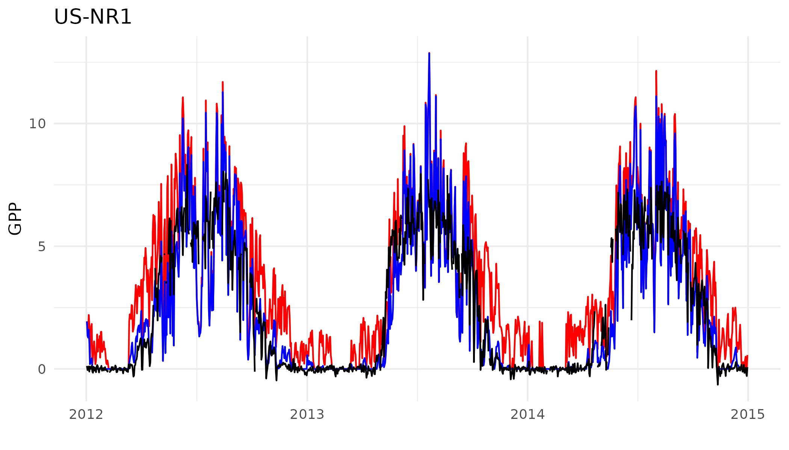

# Correcting GPP for cold acclimation and LUE effects

Demo code on how to use frost hardiness (or other temperature responses) to correct a bias in GPP across several sites.

Main functions are in the `R` folder (frost hardiness and quadratic temp. response function), demos are in analysis. The `data-raw` folder contains raw fluxes, the p-model output and forcing data. The `data` folder contains the script to merge everything, and save a consistent data frame (as called in `analysis`)

The frost hardiness function specifies how "resistant" needles are to frost damage. Values are therefore "temperatures". For the correct interpreation see the Leinone et al. 1995 or the simplified routine as implemented here by Hanninen and Kramer 2007. To convert the temperature response to a scaling factor values are capped at a lowest temperature (base_t parameter), offset and normalized between 0 and 1.

A similar approach can be implemented using temperature response function to pull down GPP at key times during the year.

# Results

Running the data for one site cold high altitude site (US-NR1) shows good results with respect to correcting the early and late season overestimation of GPP through model efforts (see `analysis/frost_hardiness_demo.R`).

This result scales with the default parameters of Hanninen and Kramer 2007 to most of the other sites in this small dataset (see `analysis/frost_hardiness_demo_all_sites.R`. See time_series.pdf (this is vector data so allows for zooming for close inspection).
